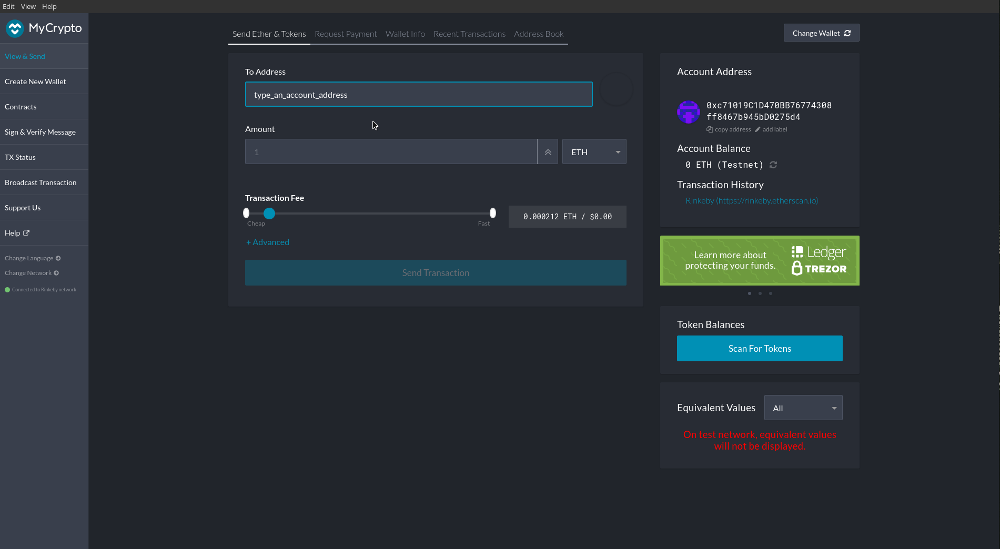

# Creating a POA Crypto Network

## Required
- [MyCrypto](https://download.mycrypto.com/)
- [Go/Geth/Puppth](https://geth.ethereum.org/downloads/) 
    - Extract Files and cd into the extracted directory.
    
## Creating the Nodes
- `./get account new --datadir <desired node name1>`
- `./get account new --datadir <desired node name2>`
You will have to give these nodes a password.
Make sure to copy the public keys for each node.

## Setting up a network using Puppeth
- `./puppeth`
You will need to do the following:
- Type in the name of the network you are going to administer
- Configure a new genesis block for that network. (Option 2)
    - Choose the network type (POA or POW) 
- Export that genesis block

## Initializing the Nodes
- `./geth init <networkname/networkname.json --datadir node1` 
- `./geth init <networkname/networkname.json --datadir node2` 
This runs geth, tells it where you stored your genesis and which node to initialize

## Start the mining process
### Getting node 1 up and running
- `./geth --datadir node1 --unlock "node1 public key" --mine --rpc --allow-insecure-unlock`
This tells geth to run node 1 and allow for insecure access. This will allow for node 2 to connect to it.
- Find "self=enode://..." and copy that address. This is the address that will be used to connect node 1 and node 2
### Getting node 2 connected with node 1
- `./geth --datadir node2 --unlock "node2 public key"--port 30304 --rpc --bootnodes "<enode://..." --allow-insecure-unlock`
This connects node 2 with node 1
## Option Descriptions
- `datadir`: The data directory for the databases and keystore
- `--unlock`: Comma separated list of accounts to unlock
- `--mine`: Enables mining
- `--rpc`: Enables the HTTP-RPC server (Will be depreciated June 2021)
- `--allow-insecure-unlock`: Allows insecure account unlocking when account-related RPCs are exposed by http
- `--botnodes` Comma separated enode URLs for P2P (Peer to Peer) discovery bootstrap
At this point, you would go to MyCrypto and connect to the New Network. However, if you've do this more than once, you will probably not be able to connect anymore.

# Connecting MyCrypto to Network
## Change Networks
Click Change Network

##  Click "Add Custom Node"

## Click "ETH" and choose a custom network

## Fill out the rest of the information and click "Save & Use Custom Node"

## Go to the home page and add your Keystore file.
- It should take you to the "Send Ether and Tokens Tab"
- Make sure you are on your custom network
- Type in the address to which you would like to send Money

- Click Send and Bob's your uncle
