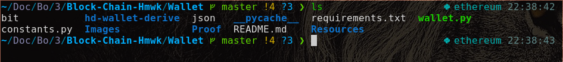
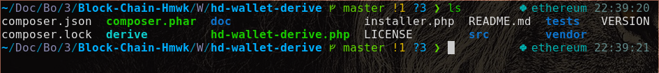
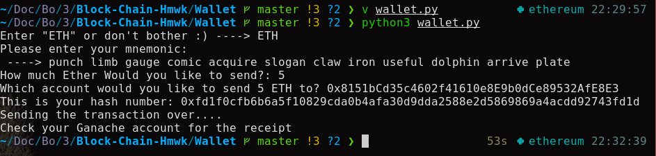
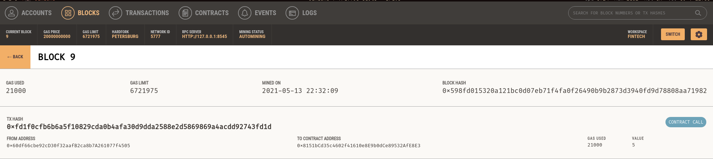

# Disclaimer: No real value is being transfered with this application. For test purposes only.

# Ethereum Transactions Via Python and Ganache

## Purpose
This code makes it possible to send and recieve transactions from one ethereum account to another.

## Setup Info
### Python
The application was created using Python and the following external libraries:1. web3
2. bit
3. eth_account
4. python-dotenv

A requirements.txt can be found and used to replicate the environment used to make this application.

`python -m pip install -r requirements.txt`

### Ganache

Ganache will need to be installed as well.
### Linux: Arch

`yay -S ganache`

### Windows

[Ganache Windows Install](https://www.trufflesuite.com/ganache)

Set up a Ganache workspace and use those accounts to run this code when prompted.

1. Set your Ganache Chain ID to be 5777
2. Set your Ganace RPC Server to be "http://127.0.0.1:8545"

### Additional Setup Info

If you don't already have a copy of hd-wallet-drive, then you will need to clone it in the directory in which wallet.py is run.

Clone Hd-wallet-drive
`git clone https://github.com/dan-da/hd-wallet-derive.git`

Next you will need to create a soft link between hd-wallet-derive.php INSIDE the hd-wallet-dervive directory using the following line of code:
`ln -s hd-wallet-derive.php derive`

Please note: If for whatever reason you can't get php to work, check the top line of the hd-wallet-derive.php file. Make sure it is using the version of php you have installed on your system.

Eg. php -- > php7 if you have php7 installed on your system.

Your file setup should look like this.

Inside the Wallet directory

Inside the hd-wallet-derive directory.

## How to use it
1. Make sure you have installed the required libraries from the requirements.txt.

2. Make sure the environment in which you installed those libraries is activated.
3. Make sure your Ganache program is running.
4. Run the program with the following command: `python3 wallet.py`
5. It will prompt you for the following information:
    - Coin Type: Enter "ETH"
    - Your Mnemonic: Found in your Ganache application if you set it up correctly.
    - Amount you would like to send.

## Example
The program will look something like this when you run it:

## Additions That I Think Would Be Interesting

1. Adding the ability for a user to add contacts/account aliases.
    - The user is allowed to select an option that would prompt them for a name and an account.
    - The next time they try to send that person money, they can just use their actual name.
    - This would be done by making a dictionary with a key (name) and a value (account).
    - The program would check to see if the user input was equal to 64 characters.
        - If it was, then it would recognize the input as an account.
        - Else, it would assume an alias was used and use the corresponding account.
